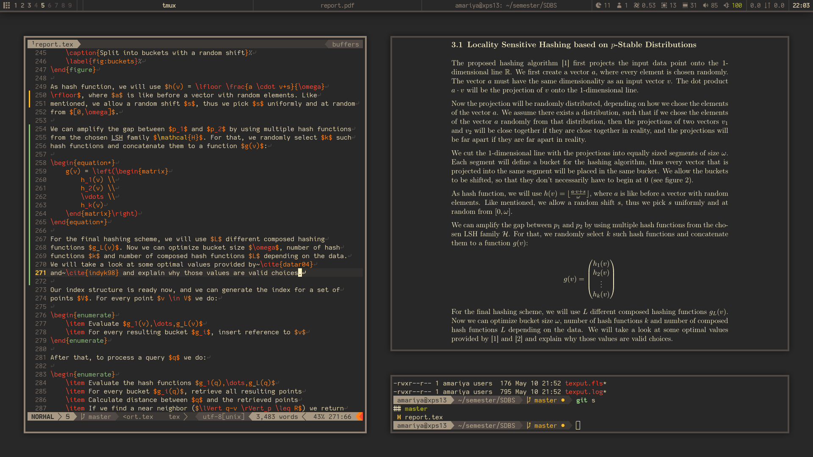
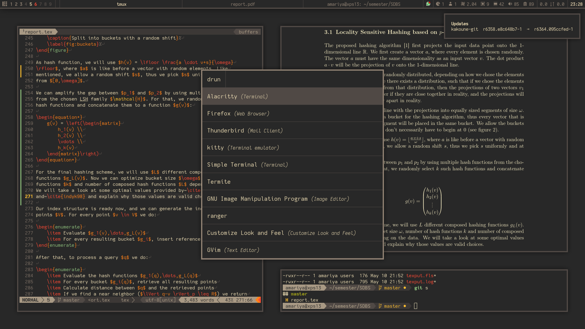
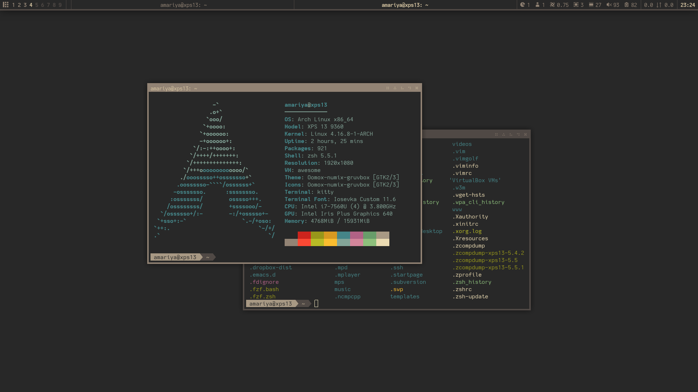

<div align="center">
    <h1>.dotfiles</h1>
    <p>There's no place like <b><code>~</code></b> !</p>
    <p>
    <!--  -->
    <!--  -->
    <!--  -->
    <!--  -->
    <!--  -->
    <!--  -->
    <!--  -->
    <!-- <br><br> -->
    
    <br><br>
    </p>
</div>

## Table of Contents

+ [Screenshots](#screenshots)
+ [Introduction](#introduction)
+ [Setup Repository](#setup-repository)
+ [Track Files](#track-files)
+ [Restore Configurations](#restore-configurations)
+ [Additional Commands](#additional-commands)

## Screenshots





## Introduction

This repository contains my personal configuration files (also known as
*dotfiles*). The package lists can be found in `~/.pkglist/`. To install all
official packages, you can use for example `cat .pkglist/pacman | pacman -S -`.

In the following sections I'll explain how this dotfiles repository was set up,
how to use it and how to restore them, for example on a new device.

**Note**: I migrated to
[dotfiles.sh](https://github.com/eli-schwartz/dotfiles.sh) by Eli Schwartz,
which is a thin wrapper for git that implements the method described here.

## Setup Repository

Setup a bare git repository in your home directory. Bare repositories have no
working directory, so setup an alias to avoid typing the long command. Add the
git directory `~/.dotfiles/` to the gitignore as a security measure. Setup
remote and push. Hide untracked files when querying the status.

```bash
git init --bare "$HOME/.dotfiles"

echo 'alias dotfiles="/usr/bin/env git --git-dir=$HOME/.dotfiles/ --work-tree=$HOME"' \
    >> "$HOME/.zshrc"
source "$HOME/.zshrc"

echo '.dotfiles' >> "$HOME/.gitignore"
dotfiles add "$HOME/.gitignore"
dotfiles commit -m 'Git: Add gitignore'

dotfiles remote add origin https://github.com/alfunx/.dotfiles
dotfiles push --set-upstream origin master
dotfiles config --local status.showUntrackedFiles no
```

## Track Files

Use the default git subcommands to track, update and remove files. You can
obviously also use branches and all other features of git.

```bash
dotfiles status
dotfiles add .zshrc
dotfiles commit -m 'Zsh: Add zshrc'
dotfiles add .vimrc
dotfiles commit -m 'Vim: Add vimrc'
dotfiles push
```

To remove a file from the repository while keeping it locally you can use:

```bash
dotfiles rm --cached ~/.some_file
```

## Restore Configurations

First clone dependent repositories, in this case for example `oh-my-zsh`. Clone
your dotfiles repository as bare repository. Setup temporary alias and then
checkout. If there exist files that collide with your repository (like a default
`.bashrc`), the files will be moved to `~/.dotfiles.bak/`. Then update all
submodules and again hide untracked files when querying the status.

```bash
git clone https://github.com/robbyrussell/oh-my-zsh \
    "$HOME/.oh-my-zsh"

git clone --bare --recursive https://github.com/alfunx/.dotfiles \
    "$HOME/.dotfiles"

function dotfiles() {
    /usr/bin/env git --git-dir="$HOME/.dotfiles/" --work-tree="$HOME" "$@"
}

dotfiles checkout
if [ "$?" -ne 0 ]; then
    mkdir -p "$HOME/.dotfiles.bak"
    dotfiles checkout 2>&1 \
        | grep -P '^\s+[\w.]' \
        | awk {'print $1'} \
        | xargs -I{} sh -c 'cp -r --parents "{}" "$HOME/.dotfiles.bak/" && rm -rf "{}"'
    dotfiles checkout
fi

dotfiles submodule update --recursive --remote
dotfiles config --local status.showUntrackedFiles no
```

Note that the automatic moving of already existing (thus conflicting) files
fails if there are too many of them (git cuts the message at some point).

The short variant, using a script with the commands above:

```bash
. <(curl -Ls https://mariya.ch/install-dotfiles)
```

(Note: This is for my personal use. Instead of directly sourcing the install
script, you should save it somewhere on your system and review it.)

## Additional Commands

Instead of the alias provided above, you can use following function. `listall`
will show all tracked files, `listtree` will show those files in a tree format
(requires the package `treeify`). You may need to use a pager for these
commands.

```bash
dotfiles() {
    case "$1" in
        listall)
            shift
            dotfiles ls-tree --full-tree -r --name-only HEAD "$@"
            ;;
        listtree)
            shift
            if hash treeify 2>/dev/null; then
                dotfiles ls-tree --full-tree -r --name-only HEAD "$@" | treeify
            else
                dotfiles listall
            fi
            ;;
        *)
            /usr/bin/env git --git-dir="$HOME/.dotfiles/" --work-tree="$HOME" "$@"
            ;;
    esac
}
```

`compdef` can provide `zsh` autocompletion of the `git` command for your
equivalent `dotfiles` command.

```bash
compdef dotfiles='git'
```
